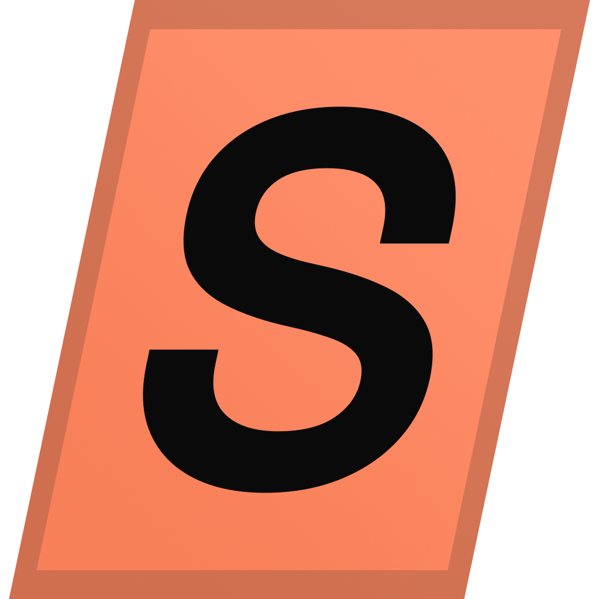

<div align="center">
  
  <h1>Sprint</h1>
  <p>Sim racing telemetry system — live data on your wheel, your engineer on voice, your setup in the cloud.</p>
</div>

Sprint is a full-stack telemetry system for sim racers. A native desktop app runs on your rig, reads live telemetry from the game, and streams data to a VoCore steering wheel display. A remote race engineer can connect from anywhere to see the same live data and push commands — change the target laptime, send pit notes, adjust dash parameters. Sessions are synced to a cloud API for post-session analysis on the web.

---

## Architecture

```
Sim Game (e.g. LeMansUltimate)
        ↓  UDP / shared memory
┌──────────────────────────────────────────────────────┐
│  .NET / Avalonia Desktop App  (/app)                 │
│                                                      │
│  C# backend (Sprint.Desktop.* projects):             │
│    · Game telemetry reader + telemetry frame pipeline│
│    · USB screen renderer  (RGB565 → WinUSB → wheel/dash screens)    │
│    · Wheel button detector  (set target lap)         │
│    · Race Engineer hub  (WebSocket, LAN or remote)   │
│    · Setup manager & sync client                     │
│                                                      │
│  Avalonia UI (XAML/C#, Sprint.Desktop.Client):       │
│    · Live telemetry  · Dash editor  · Setups         │
│    · Race Engineer status panel                      │
└──────────────────────────────────────────────────────┘
        │  RGB565 frames (WinUSB)      │  WebSocket
        ↓                          ↓
  USB Screen               Race Engineer (LAN)
  (VoCore / USBD480)       direct IP:port

        ↓  HTTP / WebSocket (sync + live stream)
┌──────────────────────────────────────────────────────┐
│  Go API Server  (/api)                               │
│    · REST API  (sessions, setups, layouts, auth)     │
│    · WebSocket relay  (remote engineer access)       │
│    · Postgres database                               │
└──────────────────────────────────────────────────────┘
        ↓  serves frontend
┌──────────────────────────────────────────────────────┐
│  Next.js Web App  (/web)                            │
│    · Telemetry analysis & session history            │
│    · Dash layout editor  (syncs ↕ via API)          │
│    · Setup management    (syncs ↕ via API)          │
│    · Race Engineer portal  (live view + commands)    │
│    · Multi-user session sharing                      │
└──────────────────────────────────────────────────────┘
```

---

## Monorepo structure

| Path | Language | Description |
|---|---|---|
| `/app` | C# / .NET | Avalonia desktop app — driver's rig |
| `/api` | Go | HTTP/WebSocket API server |
| `/web` | TypeScript | Next.js web frontend |
| `/pkg` | Go | Shared DTO types + game adapter interfaces |
| `/packages` | TypeScript | Shared UI components, types + design tokens |

The two Go modules (`api`, `pkg`) are linked by a `go.work` workspace. The desktop app (`app/Sprint.Desktop.sln`) is a separate .NET solution restored/built with the `dotnet` CLI. The web app and shared packages (`web`, `packages/*`) share a pnpm workspace managed by Turborepo.

---

## Prerequisites

| Tool | Version | Required for |
|---|---|---|
| [Go](https://go.dev) | ≥ 1.26 | API server + shared packages |
| [.NET SDK](https://dotnet.microsoft.com/download) | 10.0.x | Desktop app build |
| [Node.js](https://nodejs.org) | ≥ 20 | Web app + shared packages |
| [pnpm](https://pnpm.io) | ≥ 9 | Package manager |
| [Docker](https://www.docker.com) | — | Containerised deployment |
| [Make](https://www.gnu.org/software/make/) | — | Build shortcuts |

---

## Quick start

### Docker (API + web + database)

```bash
cp .env.example .env
make docker-up
```

- Web app → http://localhost:3000
- API server → http://localhost:8080
- Postgres → localhost:5432

### Local development

```bash
# Terminal 1 — API server
make dev-api

# Terminal 2 — Web app
make dev-web

# Terminal 3 — Desktop app (requires .NET 10 SDK; game running for real telemetry)
make dev-app
```

---

## Make targets

> Run `make help` for the authoritative, always-current target list — the table
> below is a summary. The desktop targets (`dev-app`, `build-app`, `lint-app`,
> `test-app`) drive the .NET 10 Avalonia solution via the `dotnet` CLI; there is
> no Wails build step.

```
make help          # list all targets

Development
  dev-api          Run the API server locally (go run)
  dev-web          Run the Next.js web app in dev mode

Build
  build-api        Compile API server → bin/sprint-api
  build-web        Build Next.js production output
  build-app        Publish the Avalonia desktop app → app/build/bin (dotnet publish)
  build            build-api + build-web

Test & lint
  test             Run all Go tests (api + pkg)
  test-api         Run API server tests only
  test-pkg         Run shared package tests only
  lint             go vet (api/pkg) + pnpm lint
  lint-app         Build the Avalonia solution with warnings as errors (dotnet build -warnaserror)
  fmt              gofmt + pnpm format

Docker
  docker-build     Build all Docker images
  docker-up        Start services in the background
  docker-down      Stop and remove containers
  docker-logs      Tail logs from all services

Misc
  clean            Remove bin/, web/.next/, app/build/bin/, and .NET bin/obj dirs
```

---

## Adding a new game

1. Create a new package under `pkg/games/` — e.g. `pkg/games/iracing/`
2. Implement the `GameAdapter` interface from `pkg/games/adapter.go`:
   ```go
   type GameAdapter interface {
       Name()       string
       Connect()    error
       Disconnect() error
       Read()       (*dto.TelemetryFrame, error)
   }
   ```
3. Map raw game data to the unified DTO in `pkg/dto/telemetry.go` — this Go path feeds the **API server + web**

For the **desktop app** (.NET/Avalonia), games are added separately: implement
`ITelemetrySource` (from `Sprint.Desktop.Api`) in `app/Sprint.Games`, mapping the
game's shared memory to `TelemetryFrame`, then register it via
`GameTelemetryPackage.CreateSource`. Full steps in [`app/README.md`](app/README.md#adding-a-game-desktop).

Because both surfaces map to a unified contract (`pkg/dto` / `Sprint.Desktop.Api`),
the dash renderer, engineer surfaces, web app, and sync client are unaffected by a
new adapter.

---

## Key features

### VoCore and USBD480 wheel displays
The desktop app renders RGB565 image frames and sends them to a USB screen embedded in the steering wheel via **WinUSB** (no serial port — the screen uses a vendor-specific bulk transfer protocol). Two screen families are supported:
- **VoCore M-PRO** (`VID 0xC872`) — 4"–10" OLED/LCD panels; model auto-detected via USB query
- **USBD480** (`VID 0x16C0`, `PID 0x08A7`) — NX43/NX50 800×480 displays

Both require the WinUSB driver bound in Windows (installed automatically by the vendor setup tool, or manually via [Zadig](https://zadig.akeo.ie)). Layout and content are controlled by the dash layout configuration editable in the desktop app's **Dash Designer**.

Low-level WinUSB and frame-transfer details are documented in [`docs/SCREEN_PROTOCOLS.md`](docs/SCREEN_PROTOCOLS.md).

### Dash Designer
A built-in visual editor lets you build custom wheel display layouts without writing any code:
- **Widget palette** — drag widgets from categorised groups (Layout, Timing, Car, Race) onto a grid canvas
- **Grid canvas** — 20×12 grid matching the 800×480 native screen. Widgets snap to cells; ghost overlay shows valid (orange) or invalid (red) placements in real-time
- **Properties panel** — configure widget-specific parameters (TC level 1/2/3, etc.)
- **Multiple pages** — cycle between pages via a wheel button; a dedicated Idle page is shown when no session is running
- **Live hot-reload** — saving a layout immediately updates the configured USB screen without restarting

### Wheel button — set target lap
Press a configurable wheel button to set the current delta reference to the most recent **valid lap**. A valid lap must pass all of:
- No out-lap or in-lap
- No yellow flag or safety car during the lap
- No track limits violation
- Lap time within ±5% of session best

The change triggers an immediate USB screen re-render and is broadcast to all connected engineers.

### Race Engineer mode
- Share a live session via LAN (direct IP:port) or remote invite link (via web app)
- Engineers receive the same live telemetry WebSocket stream
- Engineers can push commands: change target laptime, send pit notes, adjust dash parameters
- The desktop app is always **authoritative** — it applies or rejects engineer commands
- Both sides see command status in real time

---

## Design system

Full specification: [`docs/DESIGN.md`](docs/DESIGN.md)

Sprint uses the Graphite product language: flat near-black surfaces, hairline borders, tabular data, and one ember accent. Shared tokens live in `packages/tokens`; reusable controls live in `packages/ui`; desktop pages compose those controls instead of recreating local variants.

- **Ember `#FF6A00`** — primary action, active state, selection, and focus.
- **Graphite surfaces** — `#070707`, `#0D0D0D`, `#131313`, `#1B1B1B`.

---

## License

[GPL-3.0](LICENSE)
