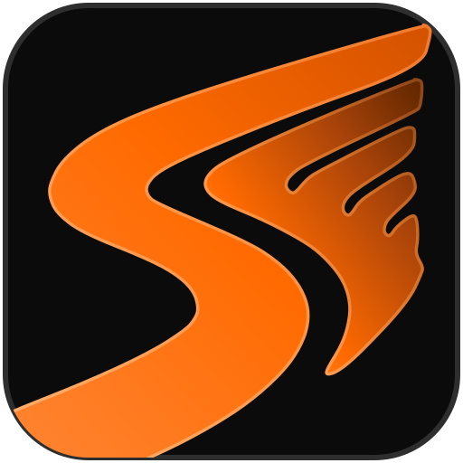

<div align="center">
  
  <h1>Sprint</h1>
  <p>Sim racing telemetry system — live data on your wheel, your engineer on voice, your setup in the cloud.</p>
</div>

Sprint is a full-stack telemetry system for sim racers. A native desktop app runs on your rig, reads live telemetry from the game, and streams data to a VoCore steering wheel display. A remote race engineer can connect from anywhere to see the same live data and push commands — change the target laptime, send pit notes, adjust dash parameters. Sessions are synced to a cloud API for post-session analysis on the web.

---

## Architecture

```
Sim Game (e.g. LeMansUltimate)
        ↓  UDP / shared memory
┌──────────────────────────────────────────────────────┐
│  Desktop App  (/app)                                 │
│                                                      │
│  Headless .NET host (Sprint.Desktop.Core + .Host):   │
│    · Game telemetry reader + telemetry frame pipeline│
│    · USB screen renderer  (RGB565 → WinUSB → wheel/dash screens)    │
│    · Wheel button detector  (set target lap)         │
│    · Race Engineer hub  (WebSocket, LAN or remote)   │
│    · Setup manager & sync client                     │
│                                                      │
│  Electron + React UI (app/desktop):                  │
│    · Live telemetry  · Dash editor  · Setups         │
│    · Race Engineer status panel                      │
└──────────────────────────────────────────────────────┘
        │  RGB565 frames (WinUSB)      │  WebSocket
        ↓                          ↓
  USB Screen               Race Engineer (LAN)
  (VoCore / USBD480)       direct IP:port

        ↓  GraphQL (queries/mutations + subscriptions)
┌──────────────────────────────────────────────────────┐
│  .NET GraphQL API Server  (/api)                     │
│    · GraphQL API  (sessions, setups, layouts, auth)  │
│    · GraphQL subscriptions  (remote engineer relay)  │
│    · Postgres (relational) + InfluxDB (telemetry)    │
└──────────────────────────────────────────────────────┘
        ↓  serves frontend
┌──────────────────────────────────────────────────────┐
│  Next.js Web App  (/web)                            │
│    · Telemetry analysis & session history            │
│    · Dash layout editor  (syncs ↕ via API)          │
│    · Setup management    (syncs ↕ via API)          │
│    · Race Engineer portal  (live view + commands)    │
│    · Multi-user session sharing                      │
└──────────────────────────────────────────────────────┘
```

---

## Monorepo structure

| Path | Language | Description |
|---|---|---|
| `/app` | C# / .NET + TypeScript | Desktop app — driver's rig (headless .NET host + Electron/React UI) |
| `/api` | C# / .NET | ASP.NET Core + HotChocolate GraphQL API server |
| `/web` | TypeScript | Next.js web frontend |
| `/packages` | TypeScript | Shared types, design tokens + the dash renderer |

The API (`api/Sprint.Api.slnx`) and the desktop app's native host (`app/Sprint.Desktop.slnx`)
are .NET solutions restored/built with the `dotnet` CLI; they share the
`app/Sprint.Contracts` DTO package. The desktop UI (`app/desktop`), the web app, and
shared packages (`web`, `packages/*`) share a pnpm workspace managed by Turborepo, and
the web app's GraphQL types are generated from `web/schema.graphql` via graphql-codegen.

---

## Prerequisites

| Tool | Version | Required for |
|---|---|---|
| [.NET SDK](https://dotnet.microsoft.com/download) | 10.0.x | Desktop app + API server build |
| [Node.js](https://nodejs.org) | ≥ 20 | Web app + shared packages |
| [pnpm](https://pnpm.io) | ≥ 9 | Package manager |
| [Docker](https://www.docker.com) | — | Containerised deployment |
| [Make](https://www.gnu.org/software/make/) | — | Build shortcuts |

---

## Quick start

### Docker (API + web + database)

```bash
cp .env.example .env
make docker-up
```

- Web app → http://localhost:3000
- API server → http://localhost:8080 (GraphQL IDE at `/graphql`)
- Postgres → localhost:5432
- InfluxDB → localhost:8086

### Local development

```bash
# Terminal 1 — API server
make dev-api

# Terminal 2 — Web app
make dev-web

# Terminal 3 — Desktop app (requires .NET 10 SDK + Node; game running for real telemetry)
make dev-app
```

---

## Make targets

> Run `make help` for the authoritative, always-current target list — the table
> below is a summary. The desktop targets (`dev-app`, `build-app`, `lint-app`,
> `test-app`) drive the .NET 10 host solution and the `app/desktop` Electron/React
> app together.

```
make help          # list all targets

Development
  dev-api          Run the API server locally (dotnet watch, hot reload)
  dev-web          Run the Next.js web app in dev mode
  dev-app          Run the desktop app (Vite + Electron + native host)
  dev-host         Run only the native desktop host (loopback HTTP, no UI)
  schema           Export the GraphQL schema → web/schema.graphql

Build
  build-api        Publish the API server → api/build/bin (dotnet publish)
  build-web        Build Next.js production output
  build-app        Publish the native host + package the Electron app → app/build/bin
  build            build-api + build-web

Test & lint
  test             Run API + desktop tests
  test-api         Run API server tests (xunit)
  test-app         Run desktop tests (native xunit + dashboard/electron TS)
  lint             Build API solution -warnaserror + pnpm lint
  lint-api         Build the API solution with warnings as errors
  lint-app         Build the desktop solution with warnings as errors + type-check the UI
  fmt              dotnet format (app + api) + pnpm format

Docker
  docker-build     Build all Docker images
  docker-up        Start services in the background
  docker-down      Stop and remove containers
  docker-logs      Tail logs from all services

Misc
  clean            Remove bin/, web/.next/, app/build/bin/, and .NET bin/obj dirs
```

---

## Adding a new game

Games are added to the desktop app's native layer (`app/Sprint.Games`):

1. Implement `ITelemetrySource` (from `Sprint.Desktop.Api`) in **`app/Sprint.Games`**,
   mapping the game's shared memory / structs to `TelemetryFrame`. Keep all
   game-specific knowledge here.
2. Implement `IGameProvider` (also from `Sprint.Desktop.Api`) and register it in
   `GameProviders`. Its `Descriptor` plus `CreateTelemetrySource()` are required;
   the `Results`, `Setups` and `Schedule` capabilities are optional — return
   `null` for whatever the game cannot do, and the UI adapts. Full steps in
   [`app/README.md`](app/README.md#adding-a-game-desktop).

Because every source maps to the unified `Sprint.Desktop.Api` contract, the dash
renderer, engineer surfaces, and hardware pipeline are unaffected by a new adapter.

---

## Key features

### VoCore and USBD480 wheel displays
The desktop app renders RGB565 image frames and sends them to a USB screen embedded in the steering wheel via **WinUSB** (no serial port — the screen uses a vendor-specific bulk transfer protocol). Two screen families are supported:
- **VoCore M-PRO** (`VID 0xC872`) — 4"–10" OLED/LCD panels; model auto-detected via USB query
- **USBD480** (`VID 0x16C0`, `PID 0x08A7`) — NX43/NX50 800×480 displays

Both require the WinUSB driver bound in Windows (installed automatically by the vendor setup tool, or manually via [Zadig](https://zadig.akeo.ie)). Layout and content are controlled by the dash layout configuration editable in the desktop app's **Dash Designer**.

Low-level WinUSB and frame-transfer details are documented in [`docs/SCREEN_PROTOCOLS.md`](docs/SCREEN_PROTOCOLS.md).

### Dash Designer
A built-in visual editor lets you build custom wheel display layouts without writing any code:
- **Widget palette** — drag widgets from categorised groups (Layout, Timing, Car, Race) onto a grid canvas
- **Grid canvas** — 20×12 grid matching the 800×480 native screen. Widgets snap to cells; ghost overlay shows valid (orange) or invalid (red) placements in real-time
- **Properties panel** — configure widget-specific parameters (TC level 1/2/3, etc.)
- **Multiple pages** — cycle between pages via a wheel button; a dedicated Idle page is shown when no session is running
- **Live hot-reload** — saving a layout immediately updates the configured USB screen without restarting

### Wheel button — set target lap
Press a configurable wheel button to set the current delta reference to the most recent **valid lap**. A valid lap must pass all of:
- No out-lap or in-lap
- No yellow flag or safety car during the lap
- No track limits violation
- Lap time within ±5% of session best

The change triggers an immediate USB screen re-render and is broadcast to all connected engineers.

### Race Engineer mode
- Share a live session via LAN (direct IP:port) or remote invite link (via web app)
- Engineers receive the same live telemetry WebSocket stream
- Engineers can push commands: change target laptime, send pit notes, adjust dash parameters
- The desktop app is always **authoritative** — it applies or rejects engineer commands
- Both sides see command status in real time

---

## Design system

The rules live in [`docs/design/design-system/DESIGN.md`](docs/design/design-system/DESIGN.md); `docs/DESIGN.md` maps them onto Sprint's surfaces.

- **Desktop app** (`app/desktop`) follows Windows Fluent, with tokens from `@sprint/tokens/windows.css`.
- **Web app** (`web/`) follows the web CI (Apple look, glass only on chrome), with tokens from `@sprint/tokens/web.css`.
- **Wheel dash** (`packages/dashboard`) is hardware output with its own palette — see [`docs/internals/dash-rendering.md`](docs/internals/dash-rendering.md).
- Brand **`#FF6A00`** (`--brand-500`) and the status colors are the only colors shared across platforms. Light and dark follow the OS.

---

## License

[GPL-3.0](LICENSE)
